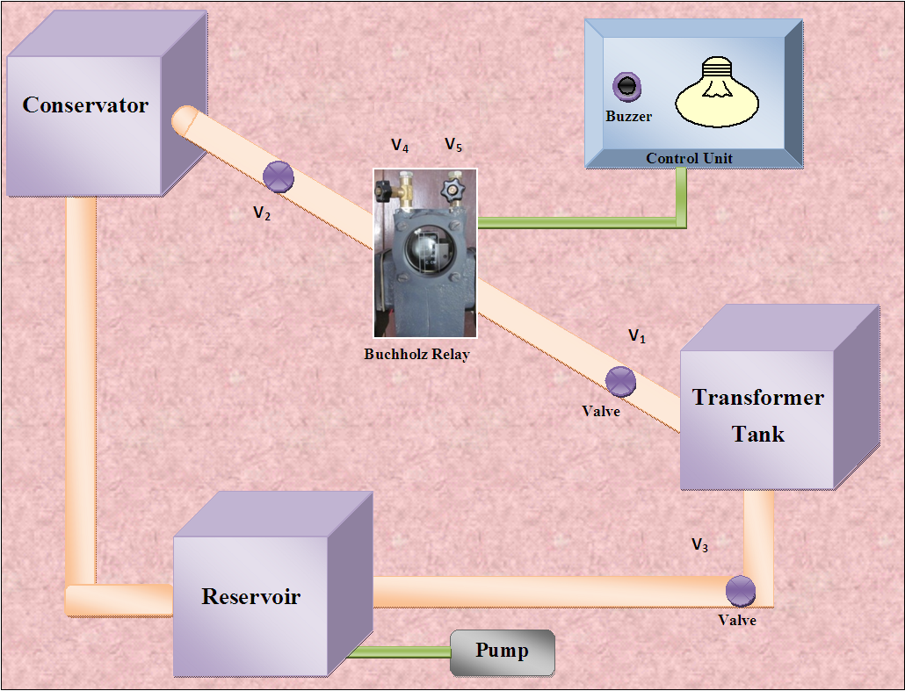

## PROCEDURAL STEPS

**Valve Designations:**
- Valve V₁ - Buchholz Relay to transformer tank
- Valve V₂ - Conservator to Buchholz Relay
- Valve V₃ - Reservoir to transformer tank
- Valve V₄ - Oil release in the Buchholz Relay (left side)
- Valve V₅ - Air release in the Buchholz Relay (right side)

**Steps:**

1. Keep all the front panel switches in OFF condition.

2. If any pressure is present in the relay, release it first by using Valve V₅ and also use the hand valve which is present on the reservoir to release the pressure from the remaining part.

3. The main power supply chord is connected at the back side of buchholz relay setup.

4. Close all Valves except V₂.

5. Fill the oil in the buchholz relay by using foot pump by little opening of the Valve V₅ (only if air lock is present in the relay).

6. Switch ON the power supply.

7. Switch ON the buzzer toggle switch.

8. Open the Valve V₁ slightly and decrease the oil level manually below the particular level by carefully seeing the oil level in the buchholz relay. Now the alarm contact will be closed and the buzzer will operate in control panel.

9. After getting the alarm indication, close the Valve V₁.

10. First release the Valve V₁ and V₃ and collect the oil into the reservoir then follow the steps 2-8 once again.

11. After completion of experiment open all the Valves including hand Valve except V4 and V5 to release the air pressure inside all the tanks.

12. After completion of experiment open all the Valves including hand Valve except V₄ and V₅ to release the air pressure inside all the tanks.

## Block Diagram 

**Fig 6.1 Block Diagram of Buchholz Relay**

## Video for experiment:
<!-- end #menu -->
   

    <b style="font-size:18px">Experiment 6. To Study the gas actuated Buchholz relay for oil filled transformer. Video-1</b>  
    <video width="480" height="360" controls>
        <source src=" videos/Exp6.mp4" type="video/mp4">
    </video>

