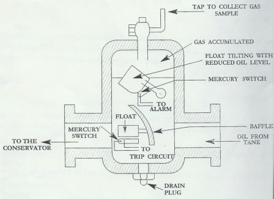
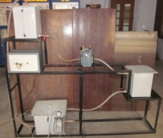

## Theory

The Buchholz relay is one of the important protective devices for oil immersed power transformer, which will operate based on the oil or gas pressure. It detects two types of faults i.e. minor and major fault. Minor faults comprise of faults in core laminations, over heating in windings, bad connections, low oil levels etc. In minor faults the alarm circuit will be actuated to switch on the buzzer. In case of major faults like internal short circuit between phase and earth, phase to phase fault, insulation break down etc., the trip circuit will be closed due to enormous amount of gas bubbles.

Buchholz relay is a gas actuated relay used for protecting oil immersed transformer against all types of internal faults and makes use of the fact that fault produces over current and overheating that decomposes oil, thus generating gases.

## Working  Principle

The Buchholz relay comprises hinged float and mercury switch assembly for both the alarm and trip circuits. The entire assembly is in an oil proof case which has two glass windows. When the oil level is reduced from the desired level, the float switch moves down that will touch the contact. In case of major faults, the gases generated in transformer tank due to decomposing of oil rush towards conservator tank through Buchholz relay. These gases pressurize the oil and reduce the oil level in buchholz relay and the float switch go down to close the trip circuit as shown in the below figure. While reducing the oil level, the alarm will get activated. If the pressure is higher in the transformer tank the trip circuit will be activated to close the mercury switch and trip the power to transformer.

    

<h2>Equipments Required  </h2>

<table align="center" border="1" cellpadding="10" cellspacing="0" style="border-collapse: collapse; margin-left: auto; margin-right: auto;">
    <tr>
        <th>Equipment</th>
        <th>Image</th>
    </tr>
    <tr>
        <td><strong>Fig.1: Buchholz Relay Setup</strong></td>
        <td align="center"></td>
    </tr>
    <tr>
        <td><strong>Fig.2: 100W Lamp</strong></td>
        <td align="center"></td>
    </tr>
</table>

<!-- end #menu -->

## Video for experiment:

   

    <b style="font-size:18px"> To Study the gas actuated Buchholz relay for oil filled transformer. Video-1</b>  
    <video width="480" height="360" controls>
        <source src=" videos/Video6.mp4" type="video/mp4">
    </video>

